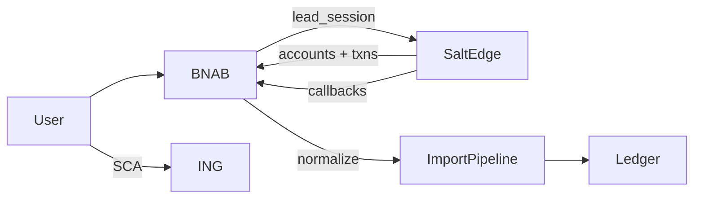

# Salt Edge × ING — open banking (long-term reference)

Durable roadmap for connecting BNAB to banks via [Salt Edge](https://www.saltedge.com/). Primary target: **ING Romania**. Product path: **Partners AIS** (no own PSD2 licence). CSV import remains forever.

Related: ADR [0011](./adr/0011-salt-edge-partners-ais.md) · [Partners API docs](https://docs.saltedge.com/partners/v1/) · [Partner Program](https://www.saltedge.com/products/account_information/partner_program) · [ING RO PSD2](https://ing.ro/ing-in-romania/informatii-utile/payment-service-directive-2)

---

## Assumptions (locked)

| Decision | Choice |
|----------|--------|
| Market | ING Romania first |
| API | Salt Edge **Partners** Account Information |
| Payments | AIS only until Phase 4 gate |
| Fallback | HomeBank ING CSV unchanged |

---

## What Salt Edge enables

| Capability | BNAB use | Phase |
|------------|----------|-------|
| Connect widget + bank SCA | Link ING without CSV export | P1–P2 |
| Accounts + balances | Map → `FinanceAccount`; statement adjust assist | P2 |
| Transactions (pending + booked) | Sync into ledger via import pipeline | P2 |
| Callbacks / auto refresh | Background sync | P2 |
| Consent refresh / reconnect | PSD2 ~90-day consent UX | P2 |
| Holder info / enrichment / merchant ID | Rule **suggestions** only (ADR 0003) | P3 |
| Other RO banks (BT, BCR, BRD, Raiffeisen, …) | Same connector | P3 |
| Payment Initiation (PIS) | Pay planned/bills from BNAB | P4 gate |

**Non-goals until P4:** moving money, storing bank passwords in BNAB, scraping Home'Bank.

---

## Phase status

| Phase | Status | Exit criteria |
|-------|--------|---------------|
| **P0** Reference & secrets docs | Done | This doc + ADR 0011 + `SALTEDGE_*` in `.env.example` |
| **P1** Pending/sandbox connector | **Validated** (2026-09-13) | Fake OAuth connect; accounts map; preview/confirm sync; reconnect consent; refresh cooldown respected |
| **P2** LIVE ING AIS | Scaffold + blocked on Salt Edge LIVE | Sync confirm + consent reconnect in app; real ING needs LIVE |
| **P3** Enrichment + multi-bank | Scaffold helpers | Suggestions + RO provider allowlist |
| **P4** Payment Initiation | **Not started — decision gate** | Explicit product/legal go-ahead |

Update this table when a phase exits.

---

## BNAB features

1. **Bank connections** (`/more/bank-connections`) — Connect widget; fake banks while Pending; ING when Live.
2. **Map accounts** — external account → `FinanceAccount`.
3. **Sync now** — fetch txns → preview (same vocabulary as CSV) → confirm → `ImportBatch` (`sourceLabel=saltedge`).
4. **Reconnect / revoke** — consent expiry; delete connection revokes Partner consent.
5. **CSV fallback** — `/more/import` unchanged.
6. Later: enrichment suggestions; multi-bank; optional PIS.

---

## Architecture

| Piece | Location |
|-------|----------|
| API client + signing | `src/lib/saltedge/client.ts` (**API v6**) |
| Callback verify | `src/lib/saltedge/callbacks.ts` |
| Normalize / preview | `src/lib/saltedge/normalize.ts` |
| Enrichment suggestions | `src/lib/saltedge/enrichment.ts` |
| RO providers | `src/lib/saltedge/providers-ro.ts` |
| PIS gate | `src/lib/saltedge/pis-gate.ts` |
| Callbacks HTTP | `src/app/api/saltedge/callbacks/*/route.ts` |
| UI | `src/app/(app)/more/bank-connections/` |

**Dedupe:** `Transaction.providerTransactionId` (unique per account) **and** `importFingerprint`.

---

## Salt Edge dashboard configuration (step-by-step)

### A. Account & company

1. Register at [saltedge.com](https://www.saltedge.com/) → Client dashboard.
2. Confirm **Partners** eligibility with Salt Edge Sales if needed.
3. Company: legal name, **Incident reporting email**, enable **2FA** (mandatory for LIVE).
4. Status: **Pending** = fake/sandbox only; **Live** = real banks after review (~2 business days).

### B. API keys & signing

5. Create **Service API key**: [API keys](https://www.saltedge.com/clients/api_keys) (Partners = Service keys only).
6. Put `App-id` + `Secret` in `/opt/bnab/shared/.env` / local `.env` — never git.
7. Generate RSA keypair; register **public** key on the API key; put private PEM in `SALTEDGE_PRIVATE_KEY` (or file path `SALTEDGE_PRIVATE_KEY_PATH`).
8. Optional: Postman with `APP_ID` / `SECRET` for smoke tests.

### C. Application & callbacks

9. Create/select Application.
10. Callbacks (HTTPS **443** for LIVE; **no redirects**):

| Callback | BNAB URL |
|----------|----------|
| Success | `https://bnab.bogza.ro/api/saltedge/callbacks/success` |
| Fail | `https://bnab.bogza.ro/api/saltedge/callbacks/fail` |
| Notify | `https://bnab.bogza.ro/api/saltedge/callbacks/notify` |
| Destroy | `https://bnab.bogza.ro/api/saltedge/callbacks/destroy` |
| Provider changes | `https://bnab.bogza.ro/api/saltedge/callbacks/provider-changes` |

11. Local Pending tests: HTTPS tunnel → local `:3010` (HTTP:80 only allowed in test/pending).
12. `return_to` / after-connect → `/more/bank-connections`.

### D. Legal (LIVE gate)

13. Incorporate Salt Edge End-user Dashboard **Terms** + **Privacy** by reference into BNAB ToS/Privacy.
14. Link end-users to Salt Edge End-user Dashboard (consent revoke).
15. Deleting a BNAB connection must revoke Partner consent via API.

### E. Validation before LIVE

16. Demo fake banks: `fake_oauth_client_xf`, `fake_client_xf`, plus ≥1 sandbox.
17. Prove: create, refresh, reconnect, delete → consent revoked.
18. Give Salt Edge AM a BNAB test login.
19. Request LIVE upgrade.

### F. Real ING Romania

20. Connect widget → Romania → ING → Home'Bank + SCA.
21. Providers API with `include_ais_fields=true`: `max_consent_days`, `refresh_timeout`, scopes.
22. Map accounts; first historical fetch; confirm review batch.
23. Consent renewal UX (~90 days) + reconnect.

### G. Ops

24. Watch Provider changes callbacks.
25. Rotate secrets; monitor incident email.
26. Confirm Partners **pricing/limits** with AM before relying on daily refresh.

---

## Env vars

See [`.env.example`](../.env.example) and [deploy.md](./deploy.md):

- `SALTEDGE_APP_ID`
- `SALTEDGE_SECRET`
- `SALTEDGE_PRIVATE_KEY` or `SALTEDGE_PRIVATE_KEY_PATH`
- `SALTEDGE_RETURN_TO` (optional override; default `{AUTH_URL}/more/bank-connections`)

---

## Phase 4 — Payment Initiation decision gate

**Do not implement PIS** until all of the following are explicitly approved:

1. Product need (e.g. pay planned payment / bill from BNAB).
2. Salt Edge Partners/Client PIS contract and pricing.
3. Legal/ToS update for payment initiation.
4. Separate ADR superseding or extending 0011 for PIS.

Code gate: `assertPisAllowed()` in `src/lib/saltedge/pis-gate.ts` throws until `SALTEDGE_PIS_ENABLED=true` **and** the ADR/decision is recorded. Default is **disabled**.

---

## Risks

- Partner eligibility / commercial pricing for self-hosted household use.
- LIVE review checklist (fake banks, ToS, 2FA, signing).
- Consent churn requires reconnect UX.
- Callbacks need public HTTPS without redirects.
- CSV↔AIS memo differences may need Import rule retunes.
- Dedupe must use provider id + fingerprint.
